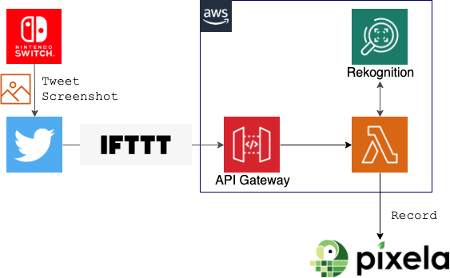
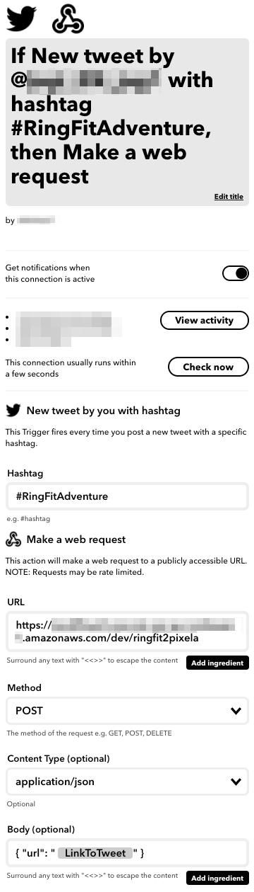

# ringfit2pixela

Transfer your [Ring Fit Adventure](https://ringfitadventure.nintendo.com/) records to a [Pixela](https://pixe.la/) graph.


1. You take screenshot(s) of your daily log (like the below) and tweet them with specific hashtag<br>
2. IFTTT capture the tweet and execute a Lambda function via API Gateway
3. The Lambda function will get image, detect text with Rekognition, and then record the extracted info to pixela graph

## Project setup
### Requirements
- Go environment
- serverless framework

### 1. compile & deploy

First, clone this repo.

```bash
git clone https://github.com/jagijagijag1/ringfit2pixela
cd ringfit2pixela
```

Describe your pixela info to `environment` clause on `serverless.yml`.
Note that this app requires Twitter API key & secret due to the specification change on a tweet page.

```yaml:serverless.yml
...
functions:
  ringfit2pixela:
    handler: bin/ringfit2pixela
    events:
      - http:
          path: ringfit2pixela
          method: post
    environment:
      TZ: Asia/Tokyo
      TOGGL_API_TOKEN: <your-api-token>
      TOGGL_PROJECT_ID: <target-project-id> 
      PIXELA_USER: <user-id>
      PIXELA_TOKEN: <your-token>
      PIXELA_GRAPH: <your-graph-id-1>
      TWITTER_CONSUMER_KEY: <your-twitter-consumer-api-key>
      TWITTER_CONSUMER_SECRET_KEY: <your-twitter-consumer-api-secret-key>
    timeout: 60
```

Then, run the following.

```bash
make deploy
```

You should obtain `ServiceEndpoint` which will be required the following step.

### 2. create IFTTT recipe
Crete the follwoing recipe on your IFTTT.
- Webhook URL should be your own API Gateway `ServiceEndpoint` which you obtained the above deployment

[](./docs/ringfit2pixela-ifttt.png)


## Current Limitations
- Only support screenshot of dialy log page like the below<br>
  
- Only extract `Time Exercising`, `Calories Burned` and `Distance Traveled`, not for each exercising log
- Our Lambda function parse the Twitter's page so depends on their specifications
- Rekognition might detect `0` as `o` which cannot be recorded on Pixela graph
